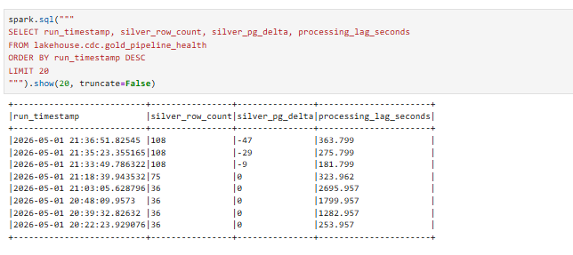
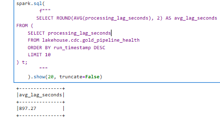
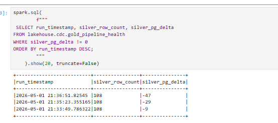
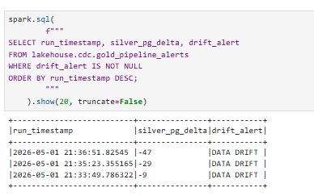

# Project 3 — CDC + Orchestrated Lakehouse Pipeline

This report covers CDC correctness, lakehouse design, orchestration, the taxi streaming path, the custom scenario, optional schema-evolution bonus, and environment keys. Operational steps (`docker compose`, seed/produce/simulate, troubleshooting) are in `README.md`.

The pipeline runs **two paths under one Airflow DAG** (`dags/cdc_lakehouse_dag.py`):

- **Path A (CDC):** PostgreSQL → Debezium → Kafka → Bronze CDC → Silver CDC (MERGE).
- **Path B (Taxi):** Taxi producer → Kafka → Bronze taxi → Silver taxi → Gold taxi.

---

## 1. CDC correctness

### Silver mirrors PostgreSQL

**Row count validation** (simulator stopped, all Debezium events flushed before the pipeline run):

| Run | silver_customers | silver_drivers | pg_customers | pg_drivers | delta |
|-----|-----------------|----------------|--------------|------------|-------|
| 1 (initial snapshot) | 10 | 8 | 10 | 8 | 0 |
| 5 (after simulate cycles) | 15 | 8 | 15 | 8 | 0 |

**Spot check** — silver row vs PostgreSQL row for the same 5 customers (converged state):

| id | name | email | country |
|----|------|-------|---------|
| 1 | Alice Mets | updated_1_454@example.com | Estonia |
| 2 | Bob Virtanen | updated_2_290@test.net | Finland |
| 6 | Frank Muller | updated_6_741@test.net | Germany |
| 7 | Grace Kim | grace@example.com | Latvia |
| 9 | Ingrid Larsen | updated_9_675@test.net | Norway |

Both silver and PostgreSQL returned identical rows for all 5 records, including rows whose email was updated by `simulate.py`.

### Deletes confirmed

`simulate.py` performs random `DELETE` operations; these appear as `op='d'` events in bronze (run 3 recorded 4 deletes) and are removed from silver via the MERGE `DELETE` branch. Customers deleted from PostgreSQL are absent from silver after the next pipeline run.

### Idempotency confirmed

Run 7 (no new changes after run 6) printed `Events (c/u/d/r): 0/0/0/0` — the `kafka_offset > watermark` filter (`lakehouse.cdc.silver_<table>_watermark`) skipped all already-processed offsets and silver row count was unchanged. `cdc_pipeline.py --stage silver` prints `No new bronze events for <table>, silver is up to date.` when re-run with no new bronze rows. The MERGE itself is idempotent: `op IN ('c','u','r')` upserts and `op='d'` deletes both produce the same end state when re-applied.

### Connector / source verification

Three quick checks the grader (or you) can run live:

- **Connector RUNNING:**
  ```bash
  curl -s http://localhost:8083/connectors/pg-cdc/status | jq .
  ```
  `screenshots/section1_connector_status.png`.

- **Kafka topic carrying CDC events:**
  ```bash
  docker exec kafka /opt/kafka/bin/kafka-console-consumer.sh `
  --bootstrap-server localhost:9092 `
  --topic dbserver1.public.customers `
  --max-messages 1
  ```
  Expected: a Debezium envelope with `payload.op` ∈ {`c`,`u`,`d`,`r`}. Excerpt below omits the Kafka record’s top-level `schema` block.

```json
{
  "payload": {
    "before": null,
    "after": {
      "id": 241,
      "name": "test user",
      "email": "testing@ut.ee",
      "country": "Estonia",
      "created_at": 1777720566051166,
      "phone": "+111-3222-3345"
    },
    "source": {
      "version": "3.0.8.Final",
      "connector": "postgresql",
      "name": "dbserver1",
      "ts_ms": 1777724238651,
      "snapshot": "false",
      "db": "sourcedb",
      "sequence": "[\"27379736\",\"27380024\"]",
      "ts_us": 1777724238651504,
      "ts_ns": 1777724238651504000,
      "schema": "public",
      "table": "customers",
      "txId": 1716,
      "lsn": 27380024,
      "xmin": null
    },
    "transaction": null,
    "op": "u",
    "ts_ms": 1777724238819,
    "ts_us": 1777724238819576,
    "ts_ns": 1777724238819576609
  }
}
```

- **PostgreSQL `wal_level=logical`:**
  ```bash
  docker exec postgres psql -U cdc_user -c "SHOW wal_level;"
  ```
  Set explicitly in [compose.yml:36](compose.yml) (`-c wal_level=logical`) so logical decoding via `pgoutput` works without manual cluster configuration. 
  
  `screenshots/wal_level.png`.

### Bronze sample row + counts

Sample event from `lakehouse.cdc.bronze_customers_flex`:

```sql
SELECT op, kafka_partition, kafka_offset,
       substr(after_json, 1, 80) AS after_json_excerpt
FROM lakehouse.cdc.bronze_customers_flex
ORDER BY kafka_offset DESC
LIMIT 1;
```

 `screenshots/section1_bronze_sample.png` showing one row with `op` (`c`/`u`/`d`/`r`), partition, offset, and a fragment of `after_json`.

Bronze row counts after a controlled test:

```sql
SELECT 'bronze_customers_flex' AS table, COUNT(*) AS rows FROM lakehouse.cdc.bronze_customers_flex
UNION ALL
SELECT 'bronze_drivers_flex',           COUNT(*)       FROM lakehouse.cdc.bronze_drivers_flex;
```
+---------------------+----+
|table                |rows|
+---------------------+----+
|bronze_customers_flex|2560|
|bronze_drivers_flex  |1738|
+---------------------+----+

Note: bronze counts grow faster than silver (bronze is append-only event history; silver is current state), so a positive `bronze_row_count − silver_row_count` is expected.

---

## 2. Lakehouse design

### Schemas

| Table | Layer | Key columns / shape |
|-------|-------|---------------------|
| `lakehouse.cdc.bronze_customers_flex` | Bronze CDC | `op STRING`, `ts_ms LONG`, `source_lsn STRING`, `before_json STRING`, `after_json STRING`, `kafka_topic`, `kafka_partition`, `kafka_offset`, `kafka_timestamp`, `ingested_at` |
| `lakehouse.cdc.bronze_drivers_flex` | Bronze CDC | same shape as above |
| `lakehouse.cdc.silver_customers` | Silver CDC | `id LONG`, `name STRING`, `email STRING`, `country STRING`, `updated_at TIMESTAMP` (current-state mirror, MERGE-maintained) |
| `lakehouse.cdc.silver_drivers` | Silver CDC | `id LONG`, `name STRING`, `city STRING`, `rating DOUBLE`, `updated_at TIMESTAMP` |
| `lakehouse.taxi.bronze` | Bronze taxi | Raw Kafka payload columns + Kafka metadata |
| `lakehouse.taxi.silver` | Silver taxi | Typed: `vendor_id`, `pickup_datetime`, `dropoff_datetime`, `ratecode_id`, `passenger_count`, `trip_distance`, `fare_amount`, `total_amount`, `pu_location_id`, `do_location_id`, `pickup_zone`, `dropoff_zone` |
| `lakehouse.taxi.gold` | Gold taxi | `pickup_hour TIMESTAMP`, `pickup_zone STRING`, `trip_count LONG`, `avg_fare DOUBLE`, `avg_distance DOUBLE`, `total_revenue DOUBLE` — partitioned by `days(pickup_hour)` |
| `lakehouse.cdc.gold_pipeline_health` | Gold CDC | One row per DAG run — see §5. |
| `lakehouse.cdc.gold_pipeline_alerts` | Gold CDC | Health + nullable `drift_alert` / `silence_alert` / `lag_alert` — see §5. |

### Schema-flexible bronze rationale

`before` and `after` are stored as **raw JSON strings** (`before_json`, `after_json`) instead of typed columns. This makes bronze immune to upstream schema additions — the pipeline does not need a `bronze` DDL change when a column is added to PostgreSQL (see §6). Silver casts specific JSON paths via `get_json_object` and `try_cast`, so bad/missing values become `NULL` rather than failed runs.

### Bronze offsets — idempotency contract

Bronze CDC is invoked from Airflow with explicit offsets:

```python
"--startingOffsets earliest --endingOffsets latest"
```

(`dags/cdc_lakehouse_dag.py:111` and `:123`). Bronze re-reads from `earliest` every run; **idempotency lives in silver** via a per-partition watermark in `lakehouse.cdc.silver_<table>_watermark` (`kafka_offset > watermark` filter + `ROW_NUMBER() OVER (PARTITION BY pk ORDER BY ts_ms DESC)` for dedup). This survives bronze re-ingests because the watermark tracks `kafka_offset`, not `ingested_at`.

### Iceberg snapshot history — `silver_customers`

| snapshot_id | committed_at | operation |
|---|---|---|
| 8700832266852403582 | 2026-04-19 19:06:09 | append |
| 7136017690846061166 | 2026-04-19 19:09:16 | overwrite |
| 4739449794291358407 | 2026-04-19 19:11:35 | overwrite |
| 1812658878092627708 | 2026-04-19 19:11:37 | overwrite |
| 505755130555120631  | 2026-04-19 19:14:03 | overwrite |
| 4730379956346649452 | 2026-04-19 19:14:04 | overwrite |
| 5359634631313701277 | 2026-04-19 19:16:31 | overwrite |
| 7734156091704858789 | 2026-04-19 19:16:33 | overwrite |
| 5659384266348904686 | 2026-04-19 19:32:26 | overwrite |
| 5762764280491288212 | 2026-04-19 19:32:28 | overwrite |

The first snapshot (`append`) is run 1 — only `op='r'` (snapshot) events. Subsequent runs produce `overwrite` snapshots because MERGE touches existing rows. Each pipeline run creates two snapshots: one for the upsert MERGE and one for the delete MERGE.

### Rollback / time travel

```sql
CALL lakehouse.system.rollback_to_snapshot(
    'lakehouse.cdc.silver_customers',
    7734156091704858789  -- previous snapshot
);
```

This restores `silver_customers` to its state before run 6. Same procedure for `silver_drivers`. After rollback, the next pipeline run resumes from the silver watermark; if the bad MERGE was caused by bronze data, fix bronze first or move the watermark back.

---

## 3. Orchestration design

### DAG configuration

DAG file: `dags/cdc_lakehouse_dag.py`.

| Setting | Value | Reason |
|---|---|---|
| `schedule_interval` | `*/15 * * * *` | 15-minute freshness SLA — balances latency against Spark startup overhead (about 30 s per task) |
| `max_active_runs` | `1` | Prevents overlapping runs that would cause silver MERGE conflicts |
| `catchup` | `False` | On restart, only the most recent interval runs — avoids flooding with historical backfill |
| `dagrun_timeout` | `1 hour` | DAG is killed if tasks stall (e.g. Spark hangs) |
| `retries` | `2` per task | Each task retries twice with a 30 s delay before marking failed |

### Task dependency chain (phased)

```
connector_health (HttpSensor → debezium_connect)
    ├── bronze_cdc_customers ──┐
    ├── bronze_cdc_drivers   ──┼── ALL bronze done ──► silver_cdc_customers ──┐
    └── bronze_taxi ───────────┘                      ├──► silver_cdc_drivers ──┤
                                                      └──► silver_taxi ──────────┴──► gold_taxi ──► validate
```

- **`connector_health`** is an `HttpSensor` (`airflow.providers.http.sensors.http.HttpSensor`) that polls `/connectors/pg-cdc/status` on the `debezium_connect` HTTP connection (auto-provisioned via `AIRFLOW_CONN_DEBEZIUM_CONNECT=http://connect:8083` in `compose.yml` — no manual UI step). The `response_check` lambda asserts both `connector.state == "RUNNING"` and every `tasks[*].state == "RUNNING"`. `mode="reschedule"`, `poke_interval=15s`, `timeout=120s` — a stalled connector frees the worker between pokes and ultimately fails the DAG, so every downstream task is skipped via `upstream_failed`.
- **Phased bronze → silver:** the three bronze tasks run in parallel; **each** of `silver_cdc_customers`, `silver_cdc_drivers`, and `silver_taxi` lists **all three** bronzes as upstream (see diagram above).
- **`gold_taxi`** lists **all three** silver tasks as upstream; **`validate`** lists **`gold_taxi` only** — aligned with `… → gold_taxi → validation`.
- **`validate`** (`jobs/health_pipeline.py`) compares `silver_customers + silver_drivers` row counts against live PostgreSQL counts. It writes one row to `lakehouse.cdc.gold_pipeline_health` and exits with code 1 if `silver_pg_delta ≠ 0`. (It does not assert taxi tables; wiring it after `gold_taxi` only enforces full-pipeline ordering.)

### DAG graph — successful run


*`manual_catchup_run_1` — all 9 tasks green. Run duration: 00:03:14 minutes.*

### Scheduling strategy

A 15-minute interval means silver CDC lags PostgreSQL by at most 15 minutes plus task execution time (about 2 minutes), for a worst-case freshness of about 17 minutes. This is acceptable for a near-real-time analytics lakehouse. For stricter SLAs the interval could be reduced to 5 minutes; below that the Spark JVM startup cost (about 30 s) becomes a significant fraction of total runtime.

### Retry and failure handling

Each task has `retries=2, retry_delay=30s`. If `connector_health` fails (Kafka Connect down), the sensor times out and all downstream tasks are skipped via `upstream_failed`. If a silver MERGE fails, `validate` does not run.

**Example failed `validate`** — `scheduled__2026-05-01T21:15:00+00:00`: while the OLTP workload was still changing faster than the scheduled DAG could fully catch up, silver row counts lagged live PostgreSQL at the moment `health_pipeline.py` ran. The task logged `Silver-PG delta: -47  DRIFT DETECTED`, `VALIDATE FAILED: silver_pg_delta=-47`, exit code 1; Airflow marked `validate` failed and ran the `on_failure` callback. A later run after catching up Kafka/bronze/silver returned `silver_pg_delta = 0`.


**Connector-failure scenario** — stop Kafka Connect and confirm the DAG surfaces the failure at `connector_health`. Repro:

```bash
docker stop connect
airflow dags trigger cdc_lakehouse_pipeline
```

Expected: `connector_health` polls `/connectors/pg-cdc/status` every 15 s; after 120 s without a `RUNNING` response it raises `AirflowSensorTimeout` and is marked failed. All seven downstream tasks transition to `upstream_failed` (skipped). Recovery: `docker start connect`; the next 15-minute schedule passes the sensor and the pipeline catches up. `screenshots/section3_connector_fail.png`.

**connector_health** log excerpt:

```bash
requests.exceptions.ConnectionError: HTTPConnectionPool(host='connect', port=8083): Max retries exceeded with url: /connectors/pg-cdc/status (Caused by NameResolutionError("<urllib3.connection.HTTPConnection object at 0x77be4997f510>: Failed to resolve 'connect' ([Errno -2] Name or service not known)"))
[2026-05-02, 09:51:26 UTC] {taskinstance.py:1226} INFO - Marking task as FAILED. dag_id=cdc_lakehouse_pipeline, task_id=connector_health, run_id=scheduled__2026-05-02T09:30:00+00:00, execution_date=20260502T093000, start_date=20260502T095123, end_date=20260502T095126
[2026-05-02, 09:51:26 UTC] {taskinstance.py:1564} INFO - Executing callback at index 0: _on_failure
[2026-05-02, 09:51:26 UTC] {cdc_lakehouse_dag.py:34} ERROR - ALERT: Task failed! DAG=cdc_lakehouse_pipeline  Task=connector_health  Run=scheduled__2026-05-02T09:30:00+00:00
[2026-05-02, 09:51:26 UTC] {taskinstance.py:341} Post task execution logs
```

### Successful consecutive scheduled runs

Five scheduled runs on **2026-05-01** (logical times 20:00–21:00 UTC) completed end-to-end with `validate` success. The next interval (**21:15** logical) failed at `validate` with drift (`silver_pg_delta = -47`); see *Example failed `validate`* above.

| Run ID | Type | Start (UTC) | Duration | validate |
|---|---|---|---|---|
| `scheduled__2026-05-01T20:00:00+00:00` | scheduled | 2026-05-01 20:18:21 | 04:10 | success |
| `scheduled__2026-05-01T20:15:00+00:00` | scheduled | 2026-05-01 20:36:24 | 03:23 | success |
| `scheduled__2026-05-01T20:30:00+00:00` | scheduled | 2026-05-01 20:45:01 | 03:15 | success |
| `scheduled__2026-05-01T20:45:00+00:00` | scheduled | 2026-05-01 21:00:01 | 03:12 | success |
| `scheduled__2026-05-01T21:00:00+00:00` | scheduled | 2026-05-01 21:15:01 | 03:46 | success |


### Backfill

With `catchup=False`, no automatic backfill occurs. Manual backfill via `airflow dags backfill` is safe because:

- Bronze re-reads from Kafka `earliest`, but silver's `kafka_offset > watermark` filter skips already-processed events.
- The silver MERGE is idempotent: re-applying the same events produces the same silver state.
- Running the DAG twice for the same interval with no new changes prints `No new bronze events for customers, silver is up to date.` and exits cleanly.

### Validate task

`jobs/health_pipeline.py` runs as the final task. It:

1. Counts `silver_customers + silver_drivers` via Spark.
2. Fetches live `COUNT(*)` from PostgreSQL via `psycopg2`.
3. Computes `silver_pg_delta = silver_count − pg_count`.
4. Appends one health record to `lakehouse.cdc.gold_pipeline_health` and rebuilds `lakehouse.cdc.gold_pipeline_alerts`.
5. Exits with code 1 if `delta ≠ 0` (Airflow marks task failed).

---

## 4. Streaming pipeline (taxi)

Implementation in `jobs/taxi_pipeline.py`.

- **Silver (`--mode silver`):**
  - **Timestamps:** `tpep_pickup_datetime` / `tpep_dropoff_datetime` parsed with `to_timestamp(..., "yyyy-MM-dd'T'HH:mm:ss")` into `pickup_datetime`, `dropoff_datetime`.
  - **Casts:** Bronze string/double fields mapped to typed columns aligned with `lakehouse.taxi.silver` DDL.
  - **Invalid trips dropped:** null pickup/dropoff, `fare_amount < 0`, `trip_distance ≤ 0`, passenger count null or outside [1, 8]; deduplicated on `(vendor_id, pickup_datetime, dropoff_datetime, pu_location_id, do_location_id)`.
  - **Zone enrichment:** `taxi_zone_lookup.parquet` joined on pickup and dropoff IDs (broadcast join) → `pickup_zone`, `dropoff_zone`.
  - **Incremental + idempotent:** silver tracks a partition-offset watermark (`lakehouse.taxi.silver_watermark`); reruns with no new bronze data are no-ops.
- **Gold (`--mode gold`):**
  - **Aggregation:** `date_trunc("hour", pickup_datetime)` as `pickup_hour`, grouped by `pickup_hour, pickup_zone`, with `trip_count`, `avg_fare`, `avg_distance`, `total_revenue`.
  - **Write semantics:** `overwritePartitions()` on `lakehouse.taxi.gold`, partitioned by `days(pickup_hour)`.
- **Airflow tasks:** `bronze_taxi` runs `taxi_pipeline.py --mode bronze --once`, `silver_taxi` runs `--mode silver --once`, `gold_taxi` runs `--mode gold`. The `--once` flag processes available data and exits rather than running as a continuous stream.

### Evidence

Row counts after full pipeline run (Jan + Feb 2025 taxi data):

| Table | Rows |
|---|---|
| `lakehouse.taxi.bronze` | 109,546 |
| `lakehouse.taxi.silver` | 1,139,464 |
| `lakehouse.taxi.gold` | 3,484 |

Top gold rows by revenue (pickup_hour, zone, aggregates):

| pickup_hour | pickup_zone | trip_count | avg_fare | avg_distance | total_revenue |
|---|---|---|---|---|---|
| 2025-01-01 21:00 | JFK Airport | 4,692 | $65.08 | 16.16 mi | $385,989 |
| 2025-01-01 19:00 | JFK Airport | 4,524 | $64.56 | 16.08 mi | $367,781 |
| 2025-01-01 16:00 | JFK Airport | 4,212 | $65.78 | 16.27 mi | $352,770 |

### Improvement over Project 2

In Project 2, the silver taxi job processed raw Bronze rows without schema validation, allowing null pickup timestamps and zero-distance trips to flow into aggregations and skew gold metrics. In this project, the silver stage applies explicit quality filters — dropping rows where `pickup_datetime` or `dropoff_datetime` is null, `fare_amount < 0`, `trip_distance ≤ 0`, or `passenger_count` is outside [1, 8] — and deduplicates on `(vendor_id, pickup_datetime, dropoff_datetime, pu_location_id, do_location_id)`. This produces a clean, typed silver table that gold aggregations can trust without further filtering.

---

## 5. Custom scenario — Pipeline Health Monitoring

Implements the **GitHub-issue custom scenario** ("gold pipeline health + alerts + queries").

### Where the GitHub-issue "Show" deliverables are answered

| Issue prompt | Where it is answered |
|--------------|----------------------|
| **Health table** accumulating rows over **at least 5 DAG runs** | Subsection *Evidence — accumulated runs (≥ 5)* below — markdown table "`gold_pipeline_health` — last runs" with **eight** rows. Notebook capture: `screenshots/section6_health_history.png`. |
| **"What was the average processing lag over the last 10 runs?"** | Subsection *Required analytical queries* — block "Average processing lag over the last 10 runs" (SQL). Result paragraph below: **avg_lag_seconds = 897.27**. Notebook capture: `screenshots/section6_avg_lag.png`. |
| **"Were there any runs with data drift between Silver and PostgreSQL?"** | Subsection *Required analytical queries* — "Runs with Silver ≠ PostgreSQL" (SQL on `gold_pipeline_health` plus equivalent on `gold_pipeline_alerts`). Tables below show three drift rows. Notebook captures: `screenshots/section6_drift_health.png`, `screenshots/section6_drift_alerts.png`. |

Drift = **`silver_pg_delta ≠ 0`** (silver row count vs live PostgreSQL).

### Scenario checklist → implementation

| Requirement | Implementation |
|-------------|----------------|
| **`lakehouse.cdc.gold_pipeline_health`** — one append-only row per DAG run | Iceberg table created in `jobs/health_pipeline.py` (`_ensure_health_table`). The Airflow `validate` task runs immediately after `gold_taxi` (which waits on all silvers), so each successful full DAG run adds exactly one row. |
| **DAG run timestamp** | Column `run_timestamp` (UTC wall-clock at job execution). |
| **CDC events by op (`c` / `u` / `d` / `r`)** | Columns `events_c`, `events_u`, `events_d`, `events_r`. **Incremental since the previous health row** (bronze rows with `ts_ms > previous run_timestamp`), so events are not double-counted across runs. |
| **Bronze vs Silver** | `bronze_row_count`, `silver_row_count`, `bronze_silver_delta`. A positive delta is expected — bronze is append-only history, silver is current state. |
| **Silver vs PostgreSQL** | `silver_pg_delta` (= silver total − PG `customers + drivers`). **Healthy steady state → 0**. |
| **New / updated / deleted customers (since last run)** | `new_customers`, `updated_customers`, `deleted_customers` — op counts on `bronze_customers_flex` only, same `ts_ms` window. |
| **Processing lag** | `processing_lag_seconds` = seconds between **now** and **`max(ts_ms)`** across both bronze CDC tables. |
| **`gold_pipeline_alerts`** | Iceberg **table** rebuilt each validate run (`writeTo … createOrReplace`) from `gold_pipeline_health` plus nullable `drift_alert` (`DATA DRIFT` if `silver_pg_delta ≠ 0`), `silence_alert` (`SOURCE DOWN` if zero CDC events in interval), `lag_alert` (`HIGH LAG` if lag **> 300 s**). Same semantics as a SQL view; we avoid `CREATE VIEW` because Spark 4.1 + Iceberg REST catalog can throw `NoSuchMethodError` on view rewrite. |
| **≥ 5 DAG runs of history** | Append-only table grows by one row per run; eight runs captured below. |

### Required analytical queries

**Average processing lag over the last 10 runs:**

```sql
SELECT ROUND(AVG(processing_lag_seconds), 2) AS avg_lag_seconds
FROM (
    SELECT processing_lag_seconds
    FROM lakehouse.cdc.gold_pipeline_health
    ORDER BY run_timestamp DESC
    LIMIT 10
) t;
```

**Runs with Silver ≠ PostgreSQL (data drift):**

```sql
SELECT run_timestamp, silver_row_count, silver_pg_delta
FROM lakehouse.cdc.gold_pipeline_health
WHERE silver_pg_delta != 0
ORDER BY run_timestamp DESC;
```

Equivalent against the alerts table (same drift rows, includes the alert column):

```sql
SELECT run_timestamp, silver_pg_delta, drift_alert
FROM lakehouse.cdc.gold_pipeline_alerts
WHERE drift_alert IS NOT NULL
ORDER BY run_timestamp DESC;
```

### Evidence — accumulated runs (≥ 5)

The capture below mixes **steady runs** (`silver_pg_delta = 0`, simulator stopped) with **later runs** where the simulator was deliberately left on during validate so `silver_pg_delta` went negative — this demonstrates the drift query and `DATA DRIFT` alert.

`gold_pipeline_health` — last runs (`run_timestamp`, `silver_row_count`, `silver_pg_delta`, `processing_lag_seconds`, `ORDER BY run_timestamp DESC` `LIMIT 20`):

| run_timestamp | silver_row_count | silver_pg_delta | processing_lag_s |
|---|---|---|---|
| 2026-05-01 21:36:51.825450 | 108 | -47 | 363.799 |
| 2026-05-01 21:35:23.355165 | 108 | -29 | 275.799 |
| 2026-05-01 21:33:49.786322 | 108 | -9 | 181.799 |
| 2026-05-01 21:18:39.943532 | 75 | 0 | 323.962 |
| 2026-05-01 21:03:05.628796 | 36 | 0 | 2695.957 |
| 2026-05-01 20:48:09.957300 | 36 | 0 | 1799.957 |
| 2026-05-01 20:39:32.826320 | 36 | 0 | 1282.957 |
| 2026-05-01 20:22:23.929076 | 36 | 0 | 253.957 |

There are **eight** rows above (≥ 5 DAG runs). Silver totals rose **36 → 75 → 108** as CDC caught up; the top three rows show **simulated drift** (Postgres ahead of silver during validate).

**What was the average processing lag over the last 10 runs?** With the history available at capture time, **avg_lag_seconds = 897.27** (seconds).

**Runs with data drift** (`silver_pg_delta ≠ 0`) — `gold_pipeline_health`:

| run_timestamp | silver_row_count | silver_pg_delta |
|---|---|---|
| 2026-05-01 21:36:51.825450 | 108 | -47 |
| 2026-05-01 21:35:23.355165 | 108 | -29 |
| 2026-05-01 21:33:49.786322 | 108 | -9 |

**Were there any runs with data drift between Silver and PostgreSQL?** — yes, three rows visible in `gold_pipeline_alerts`:

| run_timestamp | silver_pg_delta | drift_alert |
|---|---|---|
| 2026-05-01 21:36:51.825450 | -47 | DATA DRIFT |
| 2026-05-01 21:35:23.355165 | -29 | DATA DRIFT |
| 2026-05-01 21:33:49.786322 | -9 | DATA DRIFT |

Incremental CDC op counts per interval (`events_c` / `events_u` / `events_d` / `events_r`):










### Validate task log (Airflow)

`jobs/health_pipeline.py:229-279` prints two blocks per run that grader can read in the Airflow `validate` task log:

Trimmed `validate` task log from one healthy run (`Silver-PG delta: 0  OK`) and one drifting run (`DATA DRIFT`). 

```bash
[2026-05-01, 22:18:22 UTC] {subprocess.py:106} INFO - === Pipeline Health ===
[2026-05-01, 22:18:22 UTC] {subprocess.py:106} INFO - Run timestamp:       2026-05-01 22:18:15.201488
[2026-05-01, 22:18:22 UTC] {subprocess.py:106} INFO - Events (c/u/d/r):    0/0/0/0
[2026-05-01, 22:18:22 UTC] {subprocess.py:106} INFO - Bronze rows:         4298
[2026-05-01, 22:18:22 UTC] {subprocess.py:106} INFO - Silver rows:         162
[2026-05-01, 22:18:22 UTC] {subprocess.py:106} INFO - Bronze-Silver delta: 4136
[2026-05-01, 22:18:22 UTC] {subprocess.py:106} INFO - Silver-PG delta:     0  OK
[2026-05-01, 22:18:22 UTC] {subprocess.py:106} INFO - New customers:       0
[2026-05-01, 22:18:22 UTC] {subprocess.py:106} INFO - Updated customers:   0
[2026-05-01, 22:18:22 UTC] {subprocess.py:106} INFO - Deleted customers:   0
[2026-05-01, 22:18:22 UTC] {subprocess.py:106} INFO - Processing lag:      2429.5s
[2026-05-01, 22:18:22 UTC] {subprocess.py:106} INFO - 
[2026-05-01, 22:18:22 UTC] {subprocess.py:106} INFO - === Alerts ===
[2026-05-01, 22:18:23 UTC] {subprocess.py:106} INFO - +--------------------------+---------------+------------+----------------------+-----------+-------------+---------+
[2026-05-01, 22:18:23 UTC] {subprocess.py:106} INFO - |run_timestamp             |silver_pg_delta|total_events|processing_lag_seconds|drift_alert|silence_alert|lag_alert|
[2026-05-01, 22:18:23 UTC] {subprocess.py:106} INFO - +--------------------------+---------------+------------+----------------------+-----------+-------------+---------+
[2026-05-01, 22:18:23 UTC] {subprocess.py:106} INFO - |2026-05-01 22:18:15.201488|0              |0           |2429.465              |NULL       |SOURCE DOWN  |HIGH LAG |
[2026-05-01, 22:18:23 UTC] {subprocess.py:106} INFO - |2026-05-01 22:03:16.230317|0              |0           |1530.465              |NULL       |SOURCE DOWN  |HIGH LAG |
[2026-05-01, 22:18:23 UTC] {subprocess.py:106} INFO - |2026-05-01 21:48:42.247455|0              |53          |656.465               |NULL       |NULL         |HIGH LAG |
[2026-05-01, 22:18:23 UTC] {subprocess.py:106} INFO - |2026-05-01 21:36:51.82545 |-47            |0           |363.799               |DATA DRIFT |SOURCE DOWN  |HIGH LAG |
[2026-05-01, 22:18:23 UTC] {subprocess.py:106} INFO - |2026-05-01 21:35:23.355165|-29            |0           |275.799               |DATA DRIFT |SOURCE DOWN  |NULL     |
[2026-05-01, 22:18:23 UTC] {subprocess.py:106} INFO - |2026-05-01 21:33:49.786322|-9             |275         |181.799               |DATA DRIFT |NULL         |NULL     |
[2026-05-01, 22:18:23 UTC] {subprocess.py:106} INFO - |2026-05-01 21:18:39.943532|0              |144         |323.962               |NULL       |NULL         |HIGH LAG |
[2026-05-01, 22:18:23 UTC] {subprocess.py:106} INFO - |2026-05-01 21:03:05.628796|0              |0           |2695.957              |NULL       |SOURCE DOWN  |HIGH LAG |
[2026-05-01, 22:18:23 UTC] {subprocess.py:106} INFO - |2026-05-01 20:48:09.9573  |0              |0           |1799.957              |NULL       |SOURCE DOWN  |HIGH LAG |
[2026-05-01, 22:18:23 UTC] {subprocess.py:106} INFO - |2026-05-01 20:39:32.82632 |0              |0           |1282.957              |NULL       |SOURCE DOWN  |HIGH LAG |
[2026-05-01, 22:18:23 UTC] {subprocess.py:106} INFO - +--------------------------+---------------+------------+----------------------+-----------+-------------+---------+
[2026-05-01, 22:18:23 UTC] {subprocess.py:106} INFO - 
[2026-05-01, 22:18:23 UTC] {subprocess.py:106} INFO - === Avg processing lag over last 10 runs ===
[2026-05-01, 22:18:23 UTC] {subprocess.py:106} INFO - +---------------+
[2026-05-01, 22:18:23 UTC] {subprocess.py:106} INFO - |avg_lag_seconds|
[2026-05-01, 22:18:23 UTC] {subprocess.py:106} INFO - +---------------+
[2026-05-01, 22:18:23 UTC] {subprocess.py:106} INFO - |        1154.06|
[2026-05-01, 22:18:23 UTC] {subprocess.py:106} INFO - +---------------+
[2026-05-01, 22:18:23 UTC] {subprocess.py:106} INFO - 
[2026-05-01, 22:18:23 UTC] {subprocess.py:106} INFO - === Runs with data drift (silver != postgres) ===
[2026-05-01, 22:18:24 UTC] {subprocess.py:106} INFO - +--------------------------+----------------+---------------+
[2026-05-01, 22:18:24 UTC] {subprocess.py:106} INFO - |run_timestamp             |silver_row_count|silver_pg_delta|
[2026-05-01, 22:18:24 UTC] {subprocess.py:106} INFO - +--------------------------+----------------+---------------+
[2026-05-01, 22:18:24 UTC] {subprocess.py:106} INFO - |2026-05-01 21:36:51.82545 |108             |-47            |
[2026-05-01, 22:18:24 UTC] {subprocess.py:106} INFO - |2026-05-01 21:35:23.355165|108             |-29            |
[2026-05-01, 22:18:24 UTC] {subprocess.py:106} INFO - |2026-05-01 21:33:49.786322|108             |-9             |
[2026-05-01, 22:18:24 UTC] {subprocess.py:106} INFO - +--------------------------+----------------+---------------+
[2026-05-01, 22:18:24 UTC] {subprocess.py:106} INFO - 
[2026-05-01, 22:18:24 UTC] {subprocess.py:106} INFO - VALIDATE OK: silver mirrors PostgreSQL (silver_pg_delta=0).
[2026-05-01, 22:18:25 UTC] {subprocess.py:110} INFO - Command exited with return code 0
```

---

## 6. Bonus — Schema evolution

**Experiment:** add a column to PostgreSQL while the pipeline is running, then ingest bronze and run silver so the new column flows through.

```sql
-- in psql against the source DB:
ALTER TABLE customers ADD COLUMN phone TEXT;
UPDATE customers SET phone = '+372-5550-0001' WHERE id = 1;
```

Then run bronze for `customers`, then `cdc_pipeline.py --stage silver --table customers` (or the DAG tasks that perform the same steps).

**What each layer does:**

- **Debezium / Kafka:** `pgoutput` picks up the new column on the next change; the next event for `customers` carries `phone` inside `payload.after`. Schema metadata in the event envelope is updated automatically.
- **Bronze (no DDL needed):** `before` and `after` are stored as raw JSON strings (`before_json`, `after_json` — see §2 *schema-flexible bronze rationale*), so the new field lands inside `after_json` without any change to the bronze table.
- **Silver (automatic Iceberg DDL):** On each silver run, `jobs/cdc_pipeline.py` samples `after_json` from the upsert batch, unions top-level JSON keys, and issues `ALTER TABLE lakehouse.cdc.silver_<table> ADD COLUMN \`<name>\` STRING` for every safe identifier missing from Iceberg. The MERGE projection is built from that union (`id` cast to INT; drivers keep special handling for `rating` / `active`; other fields including new ones use `get_json_object`). Old bootstrap DDL in `SILVER_SCHEMAS` only applies when the silver table is first created. **Assumption:** Debezium emits a full `after` image so partial updates do not wipe columns that are omitted from `payload.after`.

**Evidence**

- `screenshots/section6_alter_postgres.png` — psql showing the `ALTER TABLE` + `UPDATE`, then the `customers` row with the new `phone`.

```bash
ALTER TABLE public.customers ADD COLUMN phone TEXT;
UPDATE public.customers SET phone = '+111-2222-3345' WHERE name = 'test user';
INSERT INTO public.customers (name, email, country, phone) VALUES ('test user', 'testing@ut.ee', 'Estonia', '+111-2222-3333');
```

- `screenshots/section6_silver_phone.png` — `SELECT phone FROM lakehouse.cdc.silver_customers WHERE name = 'test user';` with the populated value.

---

## 7. Environment values

Keys defined in `.env.example` (copied to `.env` for local runs). Values are git-ignored and not listed here.

- `MINIO_ROOT_USER`
- `MINIO_ROOT_PASSWORD`
- `PG_USER`
- `PG_PASSWORD`
- `JUPYTER_TOKEN`
- `AIRFLOW_USER`
- `AIRFLOW_PASSWORD`

---

## Checklist

- [x] `docker compose up` + seed + simulate + produce + run DAG end-to-end without errors → see `README.md` setup, plus §3 *Successful consecutive scheduled runs*.
- [x] Debezium connector is registered and **RUNNING** → §1 *Connector / source verification* (`/connectors/pg-cdc/status`).
- [x] Bronze CDC table contains raw Debezium events with correct `op`, `before`, `after` fields → §1 *Bronze sample row + counts*, §2 schema row for `bronze_*_flex`.
- [x] Silver CDC table matches PostgreSQL source (row count + spot check) → §1 *Silver mirrors PostgreSQL*.
- [x] Deletes in PostgreSQL are reflected in silver CDC → §1 *Deletes confirmed*.
- [x] Running the DAG twice produces the same silver state (idempotent) → §1 *Idempotency confirmed*; §3 *Backfill*.
- [x] Taxi bronze/silver/gold tables are correct (improved from Project 2) → §4.
- [x] Airflow DAG is visible in the UI with correct task dependencies → §3 *Task dependency chain* + DAG graph image.
- [x] At least 3 successful DAG runs shown → §3 *Successful consecutive scheduled runs* (five listed).
- [x] Retry/failure handling configured and documented → §3 *Retry and failure handling* (drift example) + *Connector-failure scenario*.
- [x] Iceberg snapshot history shown in REPORT.md → §2 *Iceberg snapshot history*.
- [x] Custom scenario implemented and documented → §5 (entire section).
- [x] REPORT.md answers all required sections → §1–§5 + §6 (bonus — dynamic silver evolution in `cdc_pipeline.py`) + §7 (environment keys).
- [x] Environment keys documented in §7; secret values only in local `.env`.
