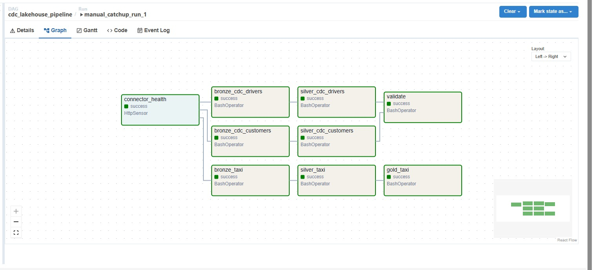
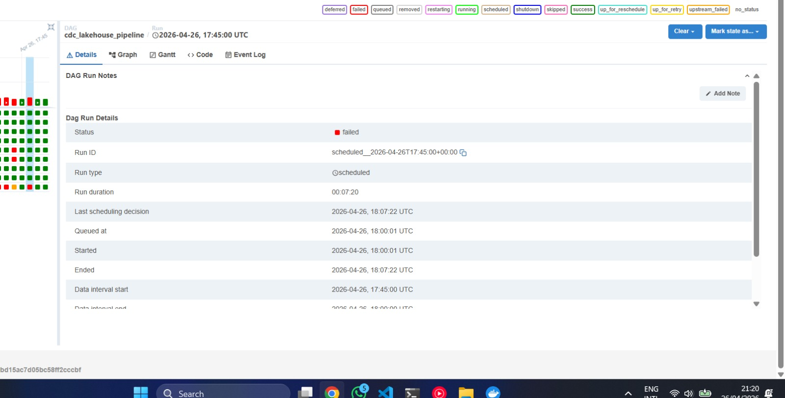
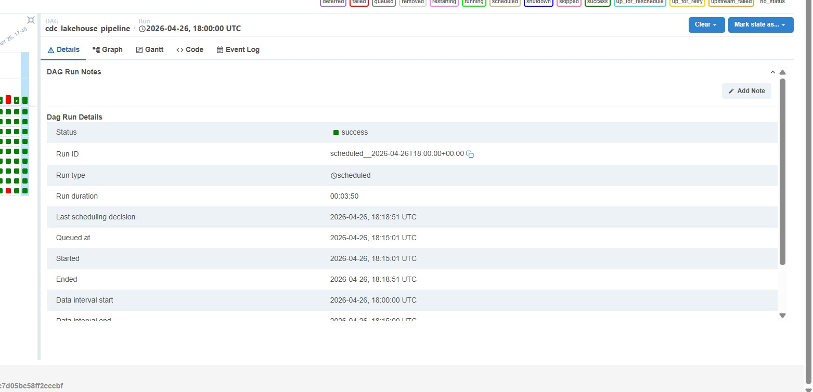

# Project 3 — CDC + Orchestrated Lakehouse Pipeline

---

### 1. Debezium CDC connector

#### Completed

- **Connector definition** lives in `config/debezium-postgres-connector.json` (connector name `pg-cdc`). It uses the Debezium **PostgreSQL** connector with **`plugin.name` = `pgoutput`** (native logical decoding), **`snapshot.mode` = `initial`** so existing rows are emitted once before the change stream (appropriate for a dev lakehouse and for proving snapshot + CDC in Kafka).
- **Captured tables:** `public.customers`, `public.drivers`. **Topic layout:** `dbserver1.public.<table>` (from `topic.prefix` + default routing).
- **Registration automation:** `scripts/register_debezium_connector.py` POSTs/updates the config against the Kafka Connect REST API (`CONNECT_URL`, default `http://localhost:8083` from the host, or `http://connect:8083` inside Compose).
- **Operational fixes applied while bringing the stack up:**
  - **`publication.autocreate.mode`:** set to **`all_tables`** so PostgreSQL publication creation succeeds (filtered mode had failed with “no table filters” for the publication in our environment).
  - **Credentials:** `database.password` aligned with the PostgreSQL user secret from `.env` (template had used a different placeholder password).
- **Delete semantics:** `tombstones.on.delete` is **`true`** so delete operations can surface tombstone records in Kafka; downstream Bronze ingestion skips null payloads but still records deletes via non-tombstone envelopes where applicable.

#### TODO (not blocking )

- [ ] Screenshot or paste: connector status **RUNNING** from Connect UI or `GET /connectors/pg-cdc/status`.
- [ ] Short justification for **`snapshot.mode`** vs alternatives (e.g. `never`) if you change it for production-style runs.
- [ ] Evidence: sample **Kafka consumer** or topic inspection showing events on `dbserver1.public.customers` and `dbserver1.public.drivers`.
- [ ] Document **`wal_level=logical`** confirmation on PostgreSQL (e.g. `SHOW wal_level;`) if not already in repo docs.

---

### 2. Bronze CDC layer (raw CDC event log)

#### Completed

- **Entrypoint:** `jobs/cdc_pipeline.py` with **`--stage bronze`** and **`--table customers|drivers`**. (Same script is intended to grow **`--stage silver`** for the `silver_cdc` Airflow task later.)
- **Execution note:** run with **`spark-submit`** inside the `jupyter` service so Iceberg and Kafka packages match `PYSPARK_SUBMIT_ARGS` in `compose.yml` (plain `python` may miss the Spark classpath).
- **Iceberg targets:** append-only tables **`lakehouse.cdc.bronze_customers_flex`** and **`lakehouse.cdc.bronze_drivers_flex`** (namespace `lakehouse.cdc` created if missing).
- **Parsing:** Debezium **JSONConverter** envelope; fields read via **`$.payload.*`** JSON paths. **`op`**, **`ts_ms`**, **`source.lsn`**, and Kafka metadata (**topic, partition, offset, timestamp**) are stored. **`before`** and **`after`** are kept as **raw JSON strings** (`before_json`, `after_json`) for **schema-flexible** Bronze (future `ALTER TABLE` / bonus schema evolution without breaking ingestion).
- **Tombstones:** rows with **null** Kafka value are **filtered out** before append (tombstone-only messages carry no payload to parse).
- **Semantics:** **append-only** — no updates/deletes in Bronze; duplicates are a concern for Silver deduplication/MERGE, not Bronze.

#### TODO

- [ ] Paste **example row** (redacted) or notebook output: `op`, fragment of `after_json`, and Kafka offset columns.
- [ ] **Row counts** after a controlled test (optional: align with simulator cadence).
- [ ] If the DAG batches Bronze runs: document **`startingOffsets` / `endingOffsets`** strategy used in `cdc_pipeline.py` (currently CLI defaults) for idempotency.

---

### 3. Silver CDC layer (current-state mirror)

#### Completed

- **Entrypoint:** `jobs/cdc_pipeline.py --stage silver --table customers|drivers`. Same script as Bronze; `--stage` selects the path.
- **Incremental read:** Silver tracks the highest `kafka_offset` processed per Kafka partition in a dedicated watermark table (`lakehouse.cdc.silver_<table>_watermark`). On each run, only bronze rows with `kafka_offset > watermark` for their partition are read. First run processes all bronze rows. `kafka_offset` is used rather than `ingested_at` because bronze re-reads from Kafka `earliest` on every run, meaning `ingested_at` changes even for already-processed rows.
- **Deduplication:** Among new bronze events, a `ROW_NUMBER()` window partitioned by primary key and ordered by `ts_ms DESC` keeps only the latest event per record. Handles cases where multiple ops arrived for the same row in one run.
- **MERGE logic:**
  - `op IN ('c', 'u', 'r')` → `WHEN MATCHED THEN UPDATE`, `WHEN NOT MATCHED THEN INSERT`
  - `op = 'd'` → `WHEN MATCHED THEN DELETE`
- **Iceberg lineage fix:** Before each `MERGE INTO`, the source DataFrame is materialized via `spark.createDataFrame(df.collect(), schema)` to break Iceberg lineage. Without this, Spark throws `[INTERNAL_ERROR] No plan for TableReference` when source and target are both Iceberg tables.
- **Debezium DECIMAL encoding:** PostgreSQL `DECIMAL(3,2)` columns (e.g. `drivers.rating`) are base64-encoded by `JsonConverter`. Parsed with `try_cast(get_json_object(after_json, '$.rating') as DOUBLE)` to return `NULL` instead of a cast failure.
- **Idempotency:** Re-running silver with no new bronze events is a no-op — the watermark filters out all already-processed offsets and the job prints `No new bronze events for <table>, silver is up to date.` Re-running after a bronze re-ingest produces the same silver state because the watermark tracks `kafka_offset`, not row identity.

#### Evidence

**Row count validation** (simulate stopped, all Debezium events flushed before pipeline run):

| Run | silver_customers | silver_drivers | pg_customers | pg_drivers | delta |
|-----|-----------------|----------------|--------------|------------|-------|
| 1 (initial snapshot) | 10 | 8 | 10 | 8 | 0 |
| 5 (after simulate cycles) | 15 | 8 | 15 | 8 | 0 |

**Spot check** — silver row vs PostgreSQL row for the same 5 customers (converged state):

| id | name | email | country |
|----|------|-------|---------|
| 1 | Alice Mets | updated_1_454@example.com | Estonia |
| 2 | Bob Virtanen | updated_2_290@test.net | Finland |
| 6 | Frank Muller | updated_6_741@test.net | Germany |
| 7 | Grace Kim | grace@example.com | Latvia |
| 9 | Ingrid Larsen | updated_9_675@test.net | Norway |

Both silver and PostgreSQL returned identical rows for all 5 records — including rows whose email was updated by `simulate.py`.

**Deletes confirmed:** `simulate.py` performs random DELETE operations; these appear as `op='d'` events in bronze (e.g. run 3 recorded 4 deletes) and are removed from silver via the MERGE DELETE branch. Customers deleted from PostgreSQL are absent from silver after the next pipeline run.

**Idempotency confirmed:** Run 7 (no new changes after run 6) printed `Events (c/u/d/r): 0/0/0/0` — watermark filtered out all already-processed offsets and silver row count was unchanged.

**Iceberg snapshot history — `silver_customers`:**

| snapshot_id | committed_at | operation |
|---|---|---|
| 8700832266852403582 | 2026-04-19 19:06:09 | append |
| 7136017690846061166 | 2026-04-19 19:09:16 | overwrite |
| 4739449794291358407 | 2026-04-19 19:11:35 | overwrite |
| 1812658878092627708 | 2026-04-19 19:11:37 | overwrite |
| 505755130555120631  | 2026-04-19 19:14:03 | overwrite |
| 4730379956346649452 | 2026-04-19 19:14:04 | overwrite |
| 5359634631313701277 | 2026-04-19 19:16:31 | overwrite |
| 7734156091704858789 | 2026-04-19 19:16:33 | overwrite |
| 5659384266348904686 | 2026-04-19 19:32:26 | overwrite |
| 5762764280491288212 | 2026-04-19 19:32:28 | overwrite |

The first snapshot (`append`) was produced by run 1 — only `op='r'` (snapshot) events, all inserts, no deletes. Subsequent runs produce `overwrite` snapshots because MERGE operations touch existing rows (updates and deletes). Each pipeline run creates two snapshots: one for the upsert MERGE and one for the delete MERGE.

**Time travel / rollback:** To roll back a bad MERGE to the previous snapshot, run:
```sql
CALL lakehouse.system.rollback_to_snapshot(
    'lakehouse.cdc.silver_customers',
    <previous_snapshot_id>
);
```
For example, rolling back to snapshot `7734156091704858789` would restore silver_customers to its state before run 6. The same applies to `silver_drivers`.

---

### 4. Airflow DAG, taxi Bronze orchestration, validation

#### DAG design

The DAG file is `dags/cdc_lakehouse_dag.py`. It orchestrates both pipelines under a single schedule with the following configuration:

| Setting | Value | Reason |
|---|---|---|
| `schedule_interval` | `*/15 * * * *` | 15-minute freshness SLA — balances latency against Spark startup overhead (~30s per task) |
| `max_active_runs` | `1` | Prevents overlapping runs that would cause silver MERGE conflicts |
| `catchup` | `False` | On restart, only the most recent interval runs — avoids flooding with historical backfill |
| `dagrun_timeout` | `1 hour` | DAG is killed if tasks stall (e.g. Spark hangs) |
| `retries` | `2` per task | Each task retries twice with a 30-second delay before marking failed |

#### Task dependency chain

```
connector_health (HttpSensor)
    ├── bronze_cdc_customers ──► silver_cdc_customers ──┐
    ├── bronze_cdc_drivers   ──► silver_cdc_drivers   ──┼──► validate
    └── bronze_taxi ──► silver_taxi ──► gold_taxi        │
                                                         │
                        [silver_cdc_customers + silver_cdc_drivers must both succeed]
```

- **`connector_health`** is an `HttpSensor` polling `http://connect:8083/connectors/pg-cdc/status` every 10 seconds. If the connector is not RUNNING the entire DAG stops — there is no point ingesting if CDC is broken.
- The three bronze tasks run in parallel after the sensor passes.
- CDC silver tasks each depend on their own bronze task. Both must succeed before `validate` runs.
- The taxi path (`bronze_taxi → silver_taxi → gold_taxi`) runs independently in parallel with CDC.
- **`validate`** (`jobs/health_pipeline.py`) compares `silver_customers.count() + silver_drivers.count()` against live PostgreSQL counts. It writes one row to `lakehouse.cdc.gold_pipeline_health` and exits with code 1 if `silver_pg_delta ≠ 0`, causing Airflow to mark it failed.

#### DAG graph — successful run



*`manual_catchup_run_1` — all 9 tasks green. Run duration: ~4 minutes.*

#### Scheduling strategy

A 15-minute interval means silver CDC lags PostgreSQL by at most 15 minutes plus task execution time (~2 minutes), for a worst-case freshness of ~17 minutes. This is acceptable for a near-real-time analytics lakehouse. For stricter SLAs the interval could be reduced to 5 minutes; below that the Spark JVM startup cost (~30s) becomes a significant fraction of total runtime.

#### Retry and failure handling

Each task has `retries=2, retry_delay=30s`. If `connector_health` fails (Kafka Connect is down), the sensor times out and all downstream tasks are skipped via `upstream_failed`. If a silver MERGE fails, `validate` does not run.

**Example failed run** — `scheduled__2026-04-26T17:45:00`:

`simulate.py` was left running during this interval, continuously inserting rows into PostgreSQL between the time silver tasks completed and when `validate` ran. Silver had processed 32 rows but PostgreSQL had grown to 91 rows by validate time, producing `silver_pg_delta = -59`. Airflow retried `validate` twice (both failed), then marked the run failed. The following run (`manual_catchup_run_1`) caught up all outstanding Kafka events and `validate` passed with `silver_pg_delta = 0`.



#### Three successful consecutive runs

| Run ID | Type | Start (UTC) | Duration | validate |
|---|---|---|---|---|
| `manual_clean_run_2` | manual | 2026-04-26 17:54:05 | 04:42 | success |
| `manual_catchup_run_1` | manual | 2026-04-26 18:08:30 | 04:06 | success |
| `scheduled__2026-04-26T18:00:00` | scheduled | 2026-04-26 18:15:01 | 03:50 | success |



#### Backfill and idempotency

With `catchup=False`, no automatic backfill occurs. Manual backfill via `airflow dags backfill` is safe because:
- Bronze re-reads from Kafka `earliest` but silver's `kafka_offset > watermark` filter skips already-processed events.
- The silver MERGE is idempotent: re-applying the same events produces the same silver state.
- Running the DAG twice for the same interval with no new changes prints `No new bronze events for customers, silver is up to date.` and exits cleanly.

#### Validate task

`jobs/health_pipeline.py` runs as the final task. It:
1. Counts `silver_customers + silver_drivers` via Spark.
2. Fetches live `COUNT(*)` from PostgreSQL via `psycopg2`.
3. Computes `silver_pg_delta = silver_count - pg_count`.
4. Appends one health record to `lakehouse.cdc.gold_pipeline_health`.
5. Exits with code 1 if `delta ≠ 0` (Airflow marks task failed).

---

### 5. Taxi pipeline — Silver & Gold (improved from Project 2)

#### Completed (implementation in `jobs/taxi_pipeline.py`)

- **Silver (`--mode silver`):**
  - **Timestamps:** `tpep_pickup_datetime` / `tpep_dropoff_datetime` parsed with **`to_timestamp(..., "yyyy-MM-dd'T'HH:mm:ss")`** into **`pickup_datetime`**, **`dropoff_datetime`**.
  - **Casts:** Bronze string/double fields mapped to **typed** columns (`vendor_id`, `ratecode_id`, money fields as `double`, etc.) aligned with **`lakehouse.taxi.silver`** DDL.
  - **Invalid trips dropped:** null pickup/dropoff, **`fare_amount < 0`**, **`trip_distance <= 0`**, passenger count null or outside **\[1, 8\]**, plus **deduplication** on `(vendor_id, pickup_datetime, dropoff_datetime, pu_location_id, do_location_id)`.
  - **Zone enrichment:** **`taxi_zone_lookup.parquet`** joined on pickup and dropoff location IDs → **`pickup_zone`**, **`dropoff_zone`** (broadcast joins).
  - **Streaming:** Silver uses **Structured Streaming** from the **Iceberg Bronze** table with a **checkpoint** (default under `.checkpoints/silver`); an initial **batch** pass processes rows already in Bronze before the stream starts.
- **Gold (`--mode gold`):**
  - **Aggregation:** `date_trunc("hour", pickup_datetime)` as **`pickup_hour`**, grouped by **`pickup_hour`** and **`pickup_zone`**, with **`trip_count`**, **`avg_fare`**, **`avg_distance`**, **`total_revenue`**.
  - **Write semantics:** **`overwritePartitions()`** on **`lakehouse.taxi.gold`**, table **partitioned by day of `pickup_hour`** (`days(pickup_hour)`).
- **Project 2 carryover / improvement hook:** Logic is adapted from the Project 2 streaming notebook; **explicit Silver deduplication** and **typed Silver schema** are concrete hygiene improvements suitable to cite vs raw Bronze-shaped streams.

#### Evidence

**Table row counts** after full pipeline run (Jan + Feb 2025 taxi data):

| Table | Rows |
|---|---|
| `lakehouse.taxi.bronze` | 109,546 |
| `lakehouse.taxi.silver` | 1,139,464 |
| `lakehouse.taxi.gold` | 3,484 |

**Top gold rows by revenue** (pickup_hour, zone, aggregates):

| pickup_hour | pickup_zone | trip_count | avg_fare | avg_distance | total_revenue |
|---|---|---|---|---|---|
| 2025-01-01 21:00 | JFK Airport | 4,692 | $65.08 | 16.16 mi | $385,989 |
| 2025-01-01 19:00 | JFK Airport | 4,524 | $64.56 | 16.08 mi | $367,781 |
| 2025-01-01 16:00 | JFK Airport | 4,212 | $65.78 | 16.27 mi | $352,770 |

**Airflow tasks:** `bronze_taxi` runs `taxi_pipeline.py --mode bronze --once`, `silver_taxi` runs `--mode silver --once`, `gold_taxi` runs `--mode gold`. All triggered every 15 minutes by the DAG. The `--once` flag causes each job to process available data and exit rather than running as a continuous stream.

#### Improvement over Project 2

In Project 2, the silver taxi job processed raw Bronze rows without schema validation, allowing null pickup timestamps and zero-distance trips to flow into aggregations and skew gold metrics. In this project, the silver stage applies explicit quality filters — dropping rows where `pickup_datetime` or `dropoff_datetime` is null, `fare_amount < 0`, `trip_distance ≤ 0`, or `passenger_count` is outside \[1, 8\] — and deduplicates on `(vendor_id, pickup_datetime, dropoff_datetime, pu_location_id, do_location_id)`. This produces a clean, typed silver table that gold aggregations can trust without further filtering.

---

### 6. Custom scenario — Pipeline Health Monitoring

#### Implemented in `jobs/health_pipeline.py`

- **Table:** `lakehouse.cdc.gold_pipeline_health` — append-only Iceberg table, one row per pipeline run.
- **Columns:** `run_timestamp`, `events_c/u/d/r` (CDC op counts since last run), `bronze_row_count`, `silver_row_count`, `bronze_silver_delta`, `silver_pg_delta` (`silver - postgres`, must be 0 when healthy), `new_customers`, `updated_customers`, `deleted_customers`, `processing_lag_seconds`.
- **PostgreSQL live counts** fetched via `psycopg2` in a subprocess (not available in Spark JVM).
- **Event counts** are scoped to the current run using the `ts_ms` watermark from the previous health row — avoids double-counting across runs.
- **Write semantics:** `writeTo(...).append()` — accumulation across runs is the core requirement; never overwrites.
- **Alert logic** (computed as SQL queries against a health table temp view after each append):
  - `silver_pg_delta != 0` → DATA DRIFT
  - `(events_c + events_u + events_d + events_r) = 0` → SOURCE DOWN
  - `processing_lag_seconds > 300` → HIGH LAG

#### Evidence — 7 accumulated runs

| run_timestamp | events_c | events_u | events_d | events_r | silver_pg_delta | processing_lag_s |
|---|---|---|---|---|---|---|
| 2026-04-19 19:06:58 | 0 | 0 | 0 | 18 | 0 | 147.0 |
| 2026-04-19 19:10:11 | 7 | 6 | 2 | 0 | 0 | 165.5 |
| 2026-04-19 19:12:27 | 4 | 7 | 4 | 0 | 0 | 112.8 |
| 2026-04-19 19:14:57 | 3 | 6 | 6 | 0 | 0 | 129.1 |
| 2026-04-19 19:17:22 | 7 | 4 | 4 | 0 | 0 | 122.1 |
| 2026-04-19 19:25:05 | 0 | 0 | 0 | 0 | 2 | 585.1 |
| 2026-04-19 19:33:45 | 0 | 0 | 0 | 0 | 0 | 962.1 |

**Avg processing lag over last 10 runs:** `401.97s` — printed automatically by the health job after each append.

**Runs with data drift** (delta ≠ 0): run 6, caused by `simulate.py` making PostgreSQL deletes after the pipeline completed run 5. Run 7 (pipeline re-run with no new simulate activity) converged back to delta = 0, confirming the pipeline self-corrects.

---

## What's in this template

| Path | Description |
|------|-------------|
| `compose.yml` | Kafka, MinIO, Iceberg REST catalog, PostgreSQL, Kafka Connect (Debezium), Airflow, Jupyter/PySpark |
| `produce.py` | Replays taxi parquet rows as JSON into the `taxi-trips` Kafka topic (same as Project 2) |
| `seed.py` | Creates source tables in PostgreSQL and inserts initial data |
| `simulate.py` | Continuously makes changes (INSERT, UPDATE, DELETE) to PostgreSQL, simulating a live OLTP workload |
| `dags/` | Place your Airflow DAG file(s) here — auto-loaded by the Airflow scheduler |
| `REPORT.md` | Template for the report you need to hand in |
| `.env.example` | Template for credentials — copy to `.env` and fill in values |
| `data/` | **Not in git.** Place the same taxi parquet files from Project 1 & 2 here |

The `data/` directory is git-ignored. You will use the same files as in previous projects:

| File | Description |
|------|-------------|
| `data/yellow_tripdata_2025-01.parquet` | NYC Yellow Taxi trips — January 2025 |
| `data/yellow_tripdata_2025-02.parquet` | NYC Yellow Taxi trips — February 2025 |
| `data/taxi_zone_lookup.parquet` | Pickup/dropoff zone names |

---

## Setup

### 1. Configure credentials

```bash
cp .env.example .env
# Edit .env — change all default passwords before starting the stack
```

The `.env` file is git-ignored and never committed.
You need to change all the default secrets, and provide them in `REPORT.md` section 8 in your project submission.

### 2. Place the data files

Same taxi data as Project 2:

```
project_3/
└── data/
    ├── yellow_tripdata_2025-01.parquet
    ├── yellow_tripdata_2025-02.parquet
    └── taxi_zone_lookup.parquet
```

### 3. Start the stack

```bash
docker compose up -d
```

Allow ~30 seconds for all services to become ready. PostgreSQL, Kafka, Kafka Connect,
MinIO, Iceberg catalog, Airflow, and Jupyter all need to start in order.

### 4. Verify services

```bash
docker ps
```

You should see these services running:

| Container | Role |
|-----------|------|
| `kafka` | Message broker (KRaft, no ZooKeeper) |
| `postgres` | OLTP source database for CDC |
| `connect` | Kafka Connect with Debezium PostgreSQL connector |
| `minio` | S3-compatible object storage for Iceberg |
| `minio_init` | One-shot bucket creation (exited is OK) |
| `iceberg-rest` | Iceberg REST catalog |
| `airflow-webserver` | Airflow UI |
| `airflow-scheduler` | Airflow DAG scheduler |
| `jupyter` | Jupyter + PySpark |

### 5. Seed the PostgreSQL source

```bash
docker exec jupyter python /home/jovyan/project/seed.py
```

This creates the source tables and inserts initial data. Verify in the Jupyter notebook:

```python
pg_execute("SELECT * FROM customers ORDER BY id;", fetch=True)
```

### 6. Start the taxi producer (same as Project 2)

```bash
docker exec jupyter python /home/jovyan/project/produce.py --loop
```

### 7. Start the change simulator

```bash
docker exec jupyter python /home/jovyan/project/simulate.py
```

This continuously makes random inserts, updates, and deletes to the PostgreSQL
source tables, simulating a live application.

### 8. Open services

| Service | URL | Credentials |
|---------|-----|-------------|
| Jupyter | http://localhost:8888 | token: `JUPYTER_TOKEN` from `.env` |
| Airflow | http://localhost:8080 | `AIRFLOW_USER` / `AIRFLOW_PASSWORD` from `.env` |
| Spark UI | http://localhost:4040 | — |
| MinIO Console | http://localhost:9001 | `MINIO_ROOT_USER` / `MINIO_ROOT_PASSWORD` from `.env` |
| Kafka Connect API | http://localhost:8083 | — |
| Iceberg REST API | http://localhost:8181/v1/namespaces | — |

### 9. Stop the stack

```bash
docker compose down          # keeps MinIO data (named volume)
docker compose down -v       # also deletes stored Iceberg tables
```

---

## What to build

Your pipeline has **two data paths**, both orchestrated by a single Airflow DAG:

```
┌─ Path A: CDC ──────────────────────────────────────────────────┐
│  PostgreSQL → Debezium → Kafka → Bronze (CDC) → Silver (MERGE) │
└────────────────────────────────────────────────────────────────┘

┌─ Path B: Streaming (from Project 2) ──────────────────────────┐
│  Taxi producer → Kafka → Bronze (taxi) → Silver → Gold         │
└────────────────────────────────────────────────────────────────┘

┌─ Airflow DAG orchestrates both paths ─────────────────────────┐
│  health_check → [bronze_cdc, bronze_taxi] → [silver_cdc,      │
│  silver_taxi] → gold_taxi → validation                         │
└────────────────────────────────────────────────────────────────┘
```

### Path A — CDC Pipeline (new)

#### 1. Debezium CDC connector

- Register a Debezium PostgreSQL connector via the Kafka Connect REST API.
- Configure it to capture changes from the source tables using log-based CDC (WAL).
- Verify that CDC events appear in Kafka topics (`dbserver1.public.<table>`).
- Handle the initial snapshot — document which snapshot mode you chose and why.

#### 2. Bronze CDC layer (raw CDC events)

- Read CDC events from Kafka using Spark.
- Parse the Debezium envelope correctly (extract from `$.payload.*` — the `schema + payload` wrapper).
- Write all events as-is to a bronze Iceberg table. Append-only — never update or delete rows in bronze.
- Include Kafka metadata (offset, partition, timestamp) alongside CDC fields (op, before, after, ts_ms).
- Handle tombstone messages (null-value records from deletes).

#### 3. Silver CDC layer (current-state mirror)

- Read from the bronze CDC table incrementally (only new events since last run).
- Deduplicate: keep only the latest event per primary key (`ROW_NUMBER` over `ts_ms DESC`).
- Apply `MERGE INTO` to the silver Iceberg table:
  - `op = 'd'` → DELETE the row
  - `op IN ('u', 'c', 'r')` → UPDATE if exists, INSERT if not
- After MERGE, silver should mirror the current state of the PostgreSQL source.
- Document your MERGE logic and explain why it is idempotent.

### Path B — Streaming Taxi Pipeline (improved from Project 2)

#### 4. Bronze → Silver → Gold for taxi data

- Same medallion pipeline as Project 2: raw Kafka events → cleaned/enriched → aggregated.
- Improve upon your Project 2 implementation based on feedback received.
- **New requirement:** this pipeline must now be triggered by Airflow, not run as a standalone streaming job.

### Orchestration (ties both paths together)

#### 5. Airflow DAG

- Create an Airflow DAG that orchestrates **both pipelines** end-to-end.
- The DAG should include at minimum:
  - A **health-check task** to verify the Debezium connector is running (REST API call).
  - **Bronze ingestion tasks** for both CDC and taxi data.
  - **Silver tasks** for both pipelines (MERGE for CDC, clean/enrich for taxi).
  - A **gold task** for the taxi aggregation.
  - A **validation task** that confirms silver CDC matches PostgreSQL source.
- **Scheduling:** Configure a reasonable schedule interval. Justify your choice — what freshness SLA does it support?
- **Retries and failure handling:** Configure task-level retries. If the MERGE task fails, downstream tasks should not run. If the connector health check fails, the DAG should alert and stop.
- **SLAs:** Set a time limit on the DAG. Configure at least one failure notification mechanism.
- **Idempotent re-runs:** Running the DAG twice for the same interval must produce the same result. This is critical for backfill scenarios.

### Bonus (not required)

#### 6. Schema evolution

- Add a column to the PostgreSQL source table while the pipeline is running.
- Show that Debezium detects the change, bronze stores both old and new events, silver evolves via `ALTER TABLE ADD COLUMN`.

---

## What is graded

Create a report (`REPORT.md`, max ~3 pages). Use the template provided.

### 1. CDC correctness

- Show that silver mirrors PostgreSQL (compare row counts and spot-check specific rows).
- Show that deletes in PostgreSQL are reflected in silver.
- Show that the pipeline is idempotent — running the DAG twice with no new changes produces the same state.

### 2. Lakehouse design

- Describe the schema of bronze CDC, silver CDC, bronze taxi, silver taxi, and gold tables.
- Show Iceberg snapshot history for the silver CDC table.
- Explain how you would roll back a bad MERGE using Iceberg time travel.

### 3. Orchestration design

- Include a screenshot of your Airflow DAG (graph view).
- Explain the task dependency chain and why tasks are in this order.
- Describe your scheduling strategy and what freshness SLA it supports.
- Describe retry and failure handling. Show at least one example of a failed task and how the DAG handled it.
- Show DAG run history — at least 3 successful consecutive runs.
- Explain how backfill works for your DAG.

### 4. Streaming pipeline (taxi)

- Show that the taxi bronze/silver/gold pipeline works correctly (same criteria as Project 2).
- Show improvements over Project 2 based on feedback.

### 5. Custom scenario

- Explain and/or show how you solved the custom scenario from the GitHub issue.

---

## Deliverables

GitHub repository containing:

- **Code:** Spark notebooks or Python scripts, Airflow DAG file(s), connector configuration, seed/simulate scripts. Must run end-to-end.
- **Report** (`REPORT.md`).
- The Iceberg tables must be queryable after running the pipeline.
- The Airflow DAG must be visible and runnable in the Airflow UI.

## How it will be checked

The grading process:

1. Clone your repository.
2. Run `docker compose up`, `seed.py`, `simulate.py`, and `produce.py`.
3. Trigger the Airflow DAG or wait for the scheduled run.
4. Verify bronze CDC contains raw CDC events, silver CDC mirrors PostgreSQL.
5. Verify bronze/silver/gold taxi tables contain correct data.
6. Stop the simulator, make a manual change in PostgreSQL, trigger the DAG, verify silver reflects the change.
7. Check Airflow for DAG run history, task logs, and retry behavior.
8. Manually fail a task (e.g., stop Kafka Connect) and verify the DAG handles it correctly.

**Share your GitHub repository link in Moodle under Module 3 as soon as possible so custom scenarios can be assigned.**

---

## Grading checklist (self-review before submission)

- [ ] `docker compose up` + seed + simulate + produce + run DAG end-to-end without errors
- [ ] Debezium connector is registered and RUNNING
- [ ] Bronze CDC table contains raw Debezium events with correct op, before, after fields
- [ ] Silver CDC table matches PostgreSQL source (row count + spot check)
- [ ] Deletes in PostgreSQL are reflected in silver CDC
- [ ] Running the DAG twice produces the same silver state (idempotent)
- [ ] Taxi bronze/silver/gold tables are correct (improved from Project 2)
- [ ] Airflow DAG is visible in the UI with correct task dependencies
- [ ] At least 3 successful DAG runs shown
- [ ] Retry/failure handling configured and documented
- [ ] Iceberg snapshot history shown in REPORT.md
- [ ] Custom scenario implemented and documented
- [ ] REPORT.md answers all required sections
- [ ] `.env` values provided in REPORT.md section 8

---

## Troubleshooting

**Debezium connector FAILED**
Check `docker compose logs connect` for errors. Common causes: PostgreSQL not reachable,
wrong credentials, `wal_level` not set to `logical`, replication slot already exists from
a previous run.

**CDC events have all NULL fields**
You are parsing from the top level instead of `$.payload.*`. Debezium wraps events in a
`{"schema": {...}, "payload": {...}}` envelope. Extract from `$.payload.op`,
`$.payload.after.id`, etc.

**PostgreSQL replication slot growing**
If the Debezium connector is stopped for a long time, PostgreSQL retains WAL segments.
Check with: `SELECT slot_name, pg_size_pretty(pg_wal_lsn_diff(pg_current_wal_lsn(), restart_lsn)) FROM pg_replication_slots;`

**Airflow DAG not appearing**
Place your DAG `.py` file in the `dags/` directory. The scheduler scans this folder.
Check `docker compose logs airflow-scheduler` for import errors.

**`Failed to find data source: kafka`**
Check `PYSPARK_SUBMIT_ARGS` in `compose.yml` — versions must match your Spark version.

**Iceberg table not found after restart**
Tables are stored in MinIO (persistent named volume). They survive container restarts
unless you run `docker compose down -v`.